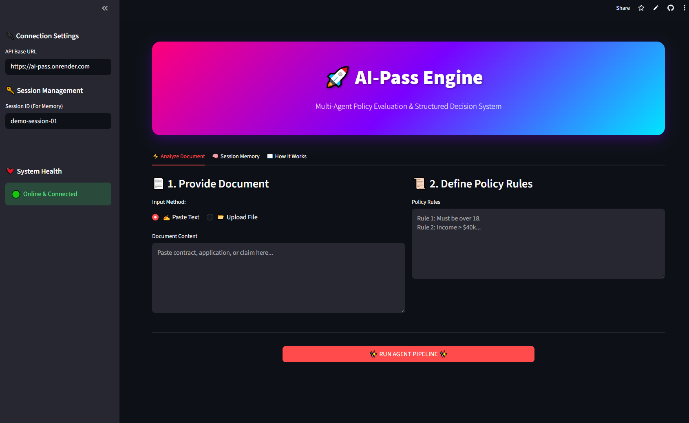

# AI-Pass: Agentic Execution Platform

> A policy-aware multi-agent decision system powered by LangGraph, RAG, and structured AI reasoning.

**Live Demo (UI):** https://ai-pass-agent.streamlit.app
**Live API:** https://ai-pass.onrender.com/docs
**GitHub:** https://github.com/mnabeelasad/ai-pass

## 🖥️ UI Preview



---

## What It Does

AI-Pass takes a **document** + **policy rules** and runs them through a multi-agent pipeline to produce a structured business decision:

```
PASS | FAIL | NEEDS_INFO
```

With supporting reasons, evidence, confidence score, and full agent step trace.

---

## Architecture

```
POST /run-task (document + policy + session_id)
         │
         ▼
 ┌─────────────────┐
 │ Ingestion Agent │  → chunks document → embeds → stores in ChromaDB
 └────────┬────────┘
          │
          ▼
 ┌─────────────────┐
 │ Retrieval Agent │  → queries ChromaDB with policy text → retrieves top-k chunks
 └────────┬────────┘
          │
          ▼
 ┌─────────────────┐
 │ Analysis Agent  │  → sends doc + context + memory → returns confidence score
 └────────┬────────┘
          │
     [Confidence Router] ← LangGraph conditional edge
       ↙         ↘
   < 0.6        ≥ 0.6
     ↓             ↓
 Re-Retrieval   Decision Agent
 (10 chunks)        ↓
     ↓            END
 Re-Analysis
     ↓
 Decision Agent
     ↓
    END

GET /result/{task_id} → { decision, reasons, evidence, confidence, steps_taken }
```

---

## Agent Design

| Agent | Role | Tool Used |
|---|---|---|
| **IngestionAgent** | Chunks + embeds document into ChromaDB | — |
| **RetrievalAgent** | RAG retrieval — 5 chunks first, 10 on retry | `retrieval_tool` |
| **AnalysisAgent** | Analyzes doc + context + memory, returns confidence | `analysis_tool` |
| **DecisionAgent** | Applies policy rules → structured verdict | `decision_tool` |

All agents share a **LangGraph StateGraph** with a common `AgentState` object.

### Advanced LangGraph Flow
- **Conditional branching** — if analysis confidence < 0.6, triggers re-retrieval
- **Re-retrieval** — broader query with 10 chunks on second attempt
- **Max 2 retrieval attempts** to prevent infinite loops
- **Memory injection** — past session decisions injected into agent context

---

## RAG Pipeline

1. **Chunking** — Sliding window (300 words, 30 overlap)
2. **Embedding** — `all-MiniLM-L6-v2` (local, free, no API key needed)
3. **Vector DB** — ChromaDB (persistent, cosine similarity)
4. **Retrieval** — Top-5 chunks (top-10 on retry) by semantic similarity
5. **Injection** — Retrieved chunks injected into LLM context for analysis

---

## Tools

### `retrieval_tool`
Queries ChromaDB for semantically relevant document chunks. Modular — accepts any collection and query. Supports re-retrieval with broader queries.

### `analysis_tool`
Sends document + context + session memory to GPT-4o-mini. Returns structured JSON with summary and confidence score (0.0–1.0).

### `decision_tool`
Sends policy + analysis to GPT-4o-mini. Returns strict JSON: `{ decision, reasons, evidence, confidence }`.

---

## Memory Layer

Each task can include a `session_id`. The system:
- Saves every decision to session memory
- Injects past decisions as context into future tasks
- Keeps last 10 decisions per session
- Helps agents avoid contradicting past decisions

---

## Document Support

| Format | Method |
|---|---|
| Plain Text | POST /run-task (JSON body) |
| PDF | POST /run-task/upload (file upload) |
| TXT | POST /run-task/upload (file upload) |
| DOCX | POST /run-task/upload (file upload) |

---

## API Endpoints

| Method | Endpoint | Description |
|---|---|---|
| `GET` | `/health` | Health check |
| `POST` | `/run-task` | Submit text document + policy |
| `POST` | `/run-task/upload` | Upload PDF/TXT/DOCX + policy |
| `GET` | `/result/{task_id}` | Get decision result |
| `GET` | `/memory/{session_id}` | Get session decision history |
| `DELETE` | `/memory/{session_id}` | Clear session memory |

### Request: POST /run-task
```json
{
  "document_text": "John Doe is applying for a $50,000 loan. Income $45,000. Credit score 680.",
  "policy_text": "Rule 1: Income must exceed $40,000. Rule 2: Credit score above 650.",
  "session_id": "my-session-123"
}
```

### Response: GET /result/{task_id}
```json
{
  "task_id": "abc-123",
  "status": "completed",
  "decision": "PASS",
  "reasons": ["Income of $45,000 meets the $40,000 threshold"],
  "evidence": ["annual income is $45,000", "credit score is 680"],
  "confidence": 0.92,
  "latency_ms": 4200,
  "steps_taken": [
    "ingestion_agent: document chunked and embedded",
    "retrieval_agent: retrieved 5 chunks (attempt 1)",
    "analysis_agent: confidence=0.92 has_context=True",
    "decision_agent: verdict=PASS confidence=0.92"
  ]
}
```

---

## What Is Real vs Mocked

| Component | Status |
|---|---|
| LangGraph orchestration | ✅ Real |
| Conditional re-retrieval flow | ✅ Real |
| ChromaDB vector store | ✅ Real |
| Document chunking | ✅ Real |
| Sentence-transformer embeddings | ✅ Real (local, free) |
| PDF / TXT / DOCX ingestion | ✅ Real |
| Memory layer (session history) | ✅ Real (in-memory) |
| LLM analysis (GPT-4o-mini) | ✅ Real (requires API key) |
| LLM decision (GPT-4o-mini) | ✅ Real (requires API key) |
| Streamlit UI | ✅ Real |
| Result store | In-memory (Redis for production) |
| Auth / rate limiting | Not implemented |

---

## Local Setup

### 1. Clone and install
```bash
git clone https://github.com/mnabeelasad/ai-pass.git
cd ai-pass
python -m venv venv
source venv/Scripts/activate  # Windows
pip install -r requirements.txt
```

### 2. Configure environment
```bash
cp .env.example .env
# Edit .env and add your OPENAI_API_KEY
```

### 3. Run API
```bash
uvicorn app.main:app --reload
# Open: http://localhost:8000/docs
```

### 4. Run Streamlit UI
```bash
streamlit run streamlit_app.py
# Open: http://localhost:8501
```

### 5. Docker
```bash
docker-compose up --build
```

---

## Deployment

| Service | Platform | Link |
|---|---|---|
| FastAPI Backend | Render | https://ai-pass.onrender.com |
| Streamlit UI | Streamlit Cloud | https://ai-pass-agent.streamlit.app |

---

## Future Improvements

- [ ] Redis result store (replace in-memory)
- [ ] Persistent memory (Redis / database)
- [ ] Streaming output via WebSockets
- [ ] Multi-document ingestion
- [ ] Qdrant as alternative vector DB
- [ ] LangSmith tracing integration
- [ ] Auth middleware (API keys)
- [ ] Dashboard with analytics

---

## Tech Stack

- **FastAPI** — REST API
- **LangGraph** — Agent orchestration + conditional flow
- **LangChain** — LLM abstraction
- **ChromaDB** — Vector database
- **Sentence-Transformers** — Local embeddings (all-MiniLM-L6-v2)
- **OpenAI GPT-4o-mini** — Analysis + decision LLM
- **pypdf + python-docx** — Document ingestion
- **Streamlit** — Frontend UI
- **Docker** — Containerization
- **Render** — API deployment
- **Streamlit Cloud** — UI deployment